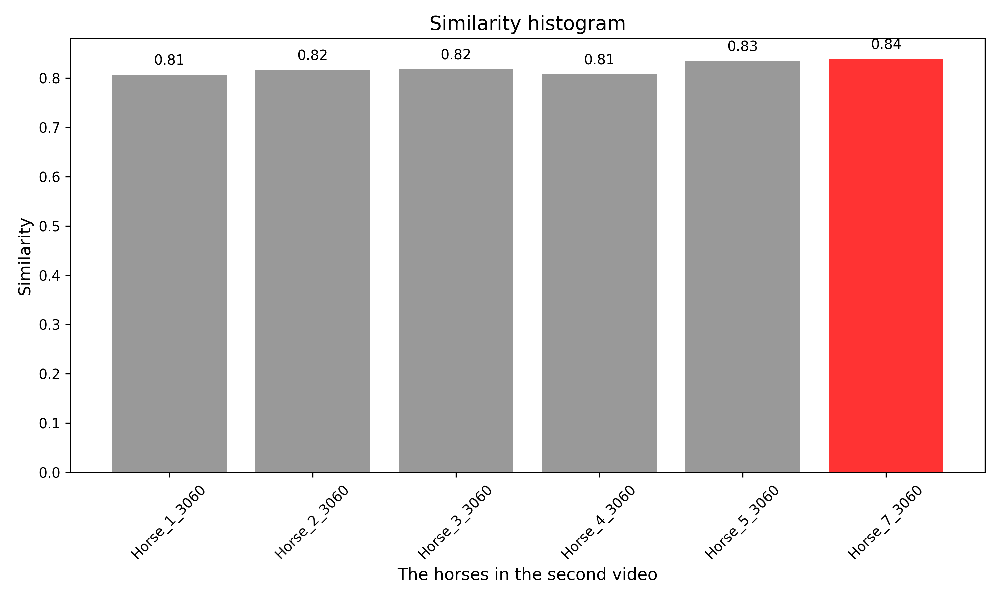
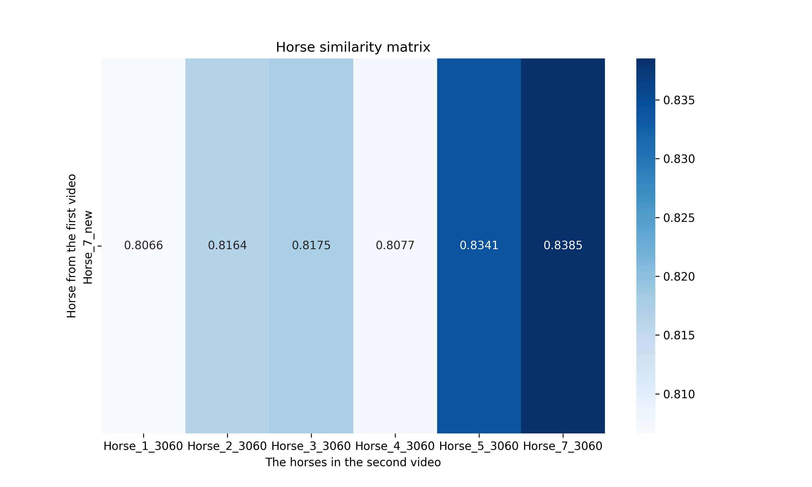

# Drone Video Horse Recognition

This project uses deep learning to analyze drone video footage and recognize individual horses based on their visual features. The program processes two datasets:

- **Training Dataset**: Contains `X_1` to `X_i` folders, each representing a unique horse.
- **Testing Dataset**: Contains `Y_1` to `Y_i` folders, each also representing a horse, some of which overlap with the training dataset.

The system computes feature vectors for each horse, compares them across datasets on a per-second basis, and generates similarity metrics for ranking and evaluation.

---

## Features
- **Feature Extraction**: Uses a pre-trained Vision Transformer (DINOv2) to extract high-dimensional feature vectors from video frames.
- **Per-Second Analysis**: Aggregates video frames into per-second averages for more robust feature comparison.
- **Cosine Similarity**: Measures the similarity between horses from the training and testing datasets.
- **Visualization**: Generates a histogram and confusion matrix to represent horse similarity.

---

## Input Data
### Training Dataset
- Folders named `X_1`, `X_2`, ..., `X_i` represent individual horses.
- Each folder contains video frames (images) of the corresponding horse.

### Testing Dataset
- Folders named `Y_1`, `Y_2`, ..., `Y_i` represent individual horses.
- These folders also contain video frames for each horse, with some horses overlapping with the training dataset.

---

## Output
### Histogram
A bar chart showing the similarity scores between each horse in the training dataset and the horses in the testing dataset.

- **X-axis**: Horses from the testing dataset.
- **Y-axis**: Similarity scores.
- **Highlighted Bar**: The best-matching horse.

### Confusion Matrix
A heatmap illustrating the similarity between horses in the training and testing datasets.

- **Rows**: True labels (training dataset horses).
- **Columns**: Predicted labels (testing dataset horses).
- **Values**: Average similarity scores.

---

## Installation and Usage

### Prerequisites
- Python 3.8+
- Required libraries:
  - `torch`
  - `transformers`
  - `Pillow`
  - `numpy`
  - `matplotlib`
  - `seaborn`
  - `tqdm`

### Steps
1. Clone this repository:
   ```bash
   git clone https://github.com/liu9756/Drone-Video-Horse-recognization.git
   cd Drone-Video-Horse-recognization
   ```

2. Install dependencies:
   ```bash
   pip install -r requirements.txt
   ```

3. Prepare your datasets:
   - Place training folders (`X_1`, `X_2`, ...) in a directory.
   - Place testing folders (`Y_1`, `Y_2`, ...) in a separate directory.

4. Run the script:
   ```bash
   python Similarity_compare.py
   ```

5. View the generated images:
   - **`similarity_histogram.png`**: Histogram showing similarity scores.
   - **`confusion_matrix.png`**: Confusion matrix visualizing horse recognition results.

---

## Example Outputs
### Similarity Histogram


This histogram highlights the best-matching horse in red, making it easy to identify which horse in the testing dataset most closely resembles a given horse from the training dataset.

### Confusion Matrix


The confusion matrix provides an overview of similarity scores between horses in the training and testing datasets, helping to evaluate the recognition performance.

---